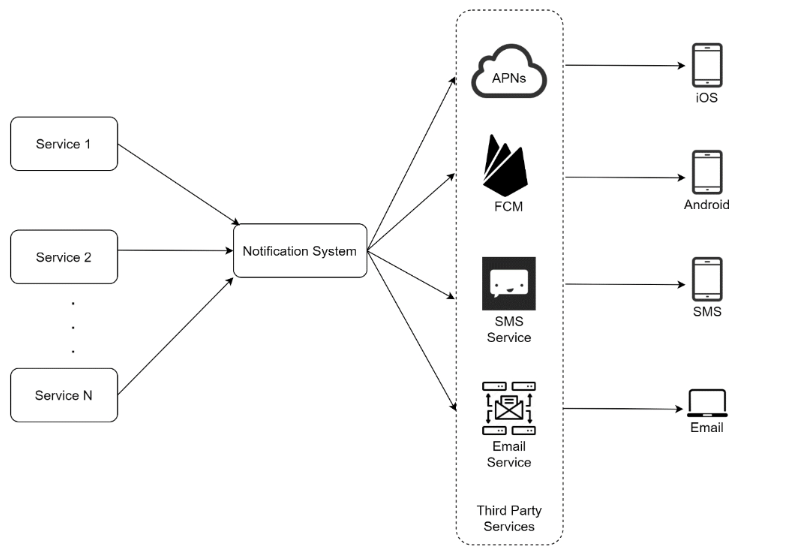
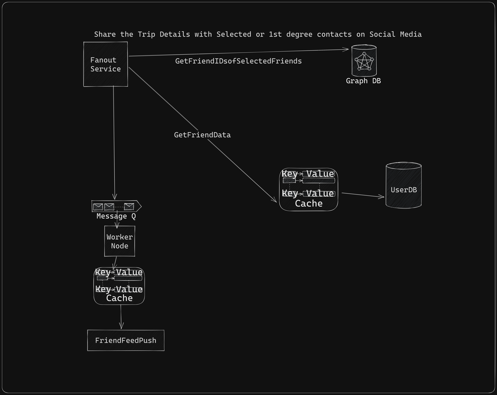

# O'Reilly Architecture Katas fall 2023

ArchKatas2023 - Next generation online trip management dashboard by The Road Warrior

This is a team submission for O'Reilly [Architecture Katas fall 2023](https://learning.oreilly.com/featured/architectural-katas/).

# Team Members:  
- [Srujana Shreevatsav](https://www.linkedin.com/in/srujanasrivatsav/)
- Akash Ranjan
- [Trupti Jogi](https://www.linkedin.com/in/trupti-jogi/)
- [Raj Dugad](https://www.linkedin.com/in/raj-dugad)

## Analysis
  - [Problem Statement](./1_Analysis/1_problem%20statement.md)
  - [Functional Requirements](./1_Analysis/2_functional%20requirements.md)
  - [Assumptions](./1_Analysis/3_assumptions.md)
  - [Technical Capability required of platform](./1_Analysis/4_technical%20Capability%20required%20of%20platform.md)
  - [Travel Domain Jargon and Acronyms](Assets/TravelDomainAcronymsandKeywords)

## Architecture
- [Actors & User roles](/2_Solution/1_actors-user-roles.md)
- [Architecture Characteristics](/2_Solution/2_architecture-characteristic.md)
- [Implicit & Desired Characteristics](/2_Solution/3_implicit-characteristics.md)
- [High-level Architecture](/Assets/Road_Warriors_HLD.png)

## Services & Algorithms
- [Email polling Algo](/2_Solution/Services/1_PollingService.md)

- [Year End Summary Reports](/2_Solution/Services/3_Summary.md)
- [Reporting and Analytics Service](/2_Solution/Services/4_Analytics.md)

## Cost Anaysis(Monthly)
 - [Summary of Estimated Cost](#cost-analysis)

## Architecture Characteristic

[Arch Worksheet](Assets/architecture-styles-worksheet.png)
The RoadWarriers App is designed to be a centralized dashboard for all the trips/bookings made by the traveller for air,train,car rental and Hotel bookings by interacting with various preferred travel agencies

The UI needs to be interactive and Rich and responsiveness on web and mobile device is high

The number of users per day 2M Weekly avergaing to approx 300k DAU and can go upto 15M at peak times like seasonal holidays,school vacations etc.Scale and Elasticity therefore are important to be factored into the design

1.  Availability: The platform must allow users to connect with each other at any time of day or night as the app is international. And 5 mins per month ~60 mins Annual downtime will need a highly available system of 99.99%.[Note: Not all services are critical and some microservices can be 99.9% available].

2.  Responsiveness: The platform must handle requests quickly enough load the web portal within 800 ms and mobile under 1 second.

3.  Interoperability: Since the system interfaces with various airlines globally, rail networks, car rentals and social media API's, interoperability with systems that are both legacy and distributed with platform agnosticity needs to be built.

4.  Scalability and Elasticity based on the Weekly user activity numbers given and also if the portal becomes popular, international demand needs to be supported.

5.  Evolvability: Both the UI and interfaces need to be designed for future extendability and to support growth of the platform in the form of new regions/vendors/travel agencies onboarded.

## CAP

Availability of the platform to a large degree and critical functions like Trip detail viewing/Airline Gate changes or updates cannot be missed by any traveller
Consistency of user experience on both web and mobile platforms as well as consistency of the data writes/reads is important

## Cost Analysis
Actual cost of cloud services depends on implementation specific details such as network ingress/egress, CPU and memory usage etc, it can only be determined after building and staging the services on the clould platform.

An estimated AWS cost analysis per month for 5 million Monthly active Users(2 million per week), obtained by pricing calculators for individual services

| Service | Usage | Cost |
| ----------- | ----------- | ----------: |
| Amazon CloudFront | 2 images per active user per month stores 5000GB per month |$430 |
| Application Load Balancer | 25 GB processed bytes per month * 0.00136986 months in an hour | $33.85 |
| AWS Lambda | 25 million requests per month with 256 MB memory x 0.0009765625 GB storage | $50.22|
| Amazon Simple Queue Service (SQS) | 1 million requests per month | $0 |
| Amazon ElastiCache | 3 instance(s) x 0.311 USD hourly x (100 / 100 Utilized/Month) x 730 hours in a month | $681.09 |
| Amazon Neptune(Graph DB) | 1 instance(s) x 0.348 USD hourly x (100 / 100 Utilized/Month) x 730 hours in a month | $298.04 |
| Amazon RDS for PostgreSQL | General Purpose SSD (gp2), Storage amount (30 GB), Instance Type (db.m5d.xlarge)  | $662.44 |
| S3 Glacier Deep Archive | 5 GB per month / 0.015625 GB average item size | $6.03 |
| Amazon CloudWatch | 25,000,000 requests x 0.00001 USD | $265.0015 |
| Total | | **$2426.67** |

## Logical View

## High Level Design

## Dashboard Presentation:

Develop a user-friendly dashboard where users can view their trips.

Provide options to edit, delete, or add new bookings to the trip.

**User Preferences Storage**

Allow users to set preferences for how they want their trips grouped or presented on the dashboard.

This architecture diagram outlines the components and interactions of a travel management system, focusing on user interaction, CRUD (Create, Read, Update, Delete) operations for reservations, real-time updates from external systems, and duplicate reservation prevention based on ticket IDs. Here's a theory breakdown of the architecture:

**User Interface(CRUD)**:

The User Interface represents the front-end component of the system where users interact with the travel management system.
It includes User Authentication for secure user access, the Travel Dashboard for managing reservations, and the Reports Generator for generating travel reports.

# Database:
The Database component stores essential data, including user information and reservation records.
It ensures data persistence and retrieval for various system functions.
[ADR for DB Design](3_ADR/DBDecision.md)

# External Systems (Cloud Based):
External Systems, represented as Cloud, symbolize interactions with external travel providers and systems.Global Distribution systems like SABRE,APOLLO have been considered for the design.
These systems provide real-time updates on travel information, such as flight statuses and hotel bookings.

# The Travel Dashboard is the central component for managing travel reservations.
It enables users to perform CRUD operations on reservations (Create, Read, Update, Delete) both manually and through real-time updates.
Real-time updates from External Systems enhance reservation data with the latest information.
[CRUD Details](/2_Solution/User-CRUD.md)

# Duplicate Check Logic:
This component is responsible for preventing the addition of duplicate reservations based on ticket IDs.
It is integrated with the Travel Dashboard to validate new reservations against existing ones.
If a duplicate is detected, the system prevents the addition of the reservation.

[Polling Service Logic ](2_Solution/Services/1_PollingService.md)

[ADR for Polling Email](3_ADR/PollingForEmailCheck)

# Reservation Flow:
When a user performs CRUD operations on reservations (Create, Read, Update, Delete), the Travel Dashboard handles the user's request.
The Duplicate Check Logic is triggered when adding a new reservation. It checks if the new reservation has the same ticket ID as an existing one.
If a duplicate is found, the system prevents the addition of the reservation and provides feedback to the user.
If it's a valid reservation, the Travel Dashboard updates the reservation data in the database.

# Interactions:
Users interact with the User Interface, which handles login/logout and provides a dashboard for reservation management and report generation.
Real-time updates from External Systems enhance the reservation data with the latest information from travel providers.
The Database stores user data and reservation records, ensuring data integrity.
The Travel Dashboard is the core component that processes user requests and ensures reservations are managed efficiently.

**Benefits**:
This architecture ensures data integrity by preventing duplicate reservations based on ticket IDs.
Users have full control over their reservations with the ability to manually add, update, or delete them.
Real-time updates complement manual reservation management for a comprehensive travel dashboard.
This architecture provides a clear and structured design for a travel management system, allowing users to efficiently manage their reservations while maintaining data accuracy. It also seamlessly integrates real-time updates to keep travel information up-to-date.

**Data Extractor**

We will use a dictionary to search email as well as to group trip's which have similar trip id's together.

Extract relevant details from the identified emails, including:
Flight Dictionary (e.g., airline, flight number, departure, arrival, date, time).
Rail Dictionary (e.g., train name, departure, arrival, date, time).
Car rental Dictionary (e.g., rental agency, pickup, return location, date, time).
Hotel Dictionary(e.g. , ReservationId,Bed,Breakfast,City,Date,time).

**Data Storage**
We will then store the extracted travel booking data in a database which will be used for faster retrieval during Traveller Feed generation on dashboard. We will need separate tables for different types of bookings (air, rail, car).

**Trip Grouping**
We are proposing to implement a trip grouping algorithm that identifies bookings belonging to the same trip based on shared criteria (e.g., common dates, destinations,Traveller details).

[ADR for Trip grouping](3_ADR/TripGrouping)
For this 1. Group the bookings into trips and create a trip identifier(TraceId of Trip) that can be used across all microservices for tracking and tracability.

         2. Display each trip with a summary of the bookings (flights, trains, car rentals) and relevant details (dates, times, destinations) in a readable manner from the above DB.
         
         3.Check with the user if the displayed information is correct,else allow user to make changes and update the change into a database for a machine learning data model implementation in future.
         
          4.If trips are not visible,provide forms/fields to update the infomration manually.Implementing additional Machine Learning principles could bring value by adding more key value pairs to dictionaries and analysing frequent tarveller/destination lists to group trips in future.

**Pre-fetch Cache**
We also propose the use of a cache to pre fetch some of the trip information ahead of time.This can be a batch job running a few times a day and is configurable based on trip frequency and user preferences.

Static Information liek PNR,Name,Flight/Train Name,Travel Agency/Car rental name etc can be localised with language using CDN and localisation.

Dynamic information like Flight times/Gate chnages etc can be fetched on demand to reduce load time.

[ADR for fast load of dashboard](3_ADR/FastLoadofDashboard)
## Notifications and Alerts:

Implement notifications/alerts to inform users when new bookings are detected or when trip details are updated.

Different types of channels to notify traveller as gate change/airline delays/price changes need to be communicated to avoid poor CX.

So we have adopted an omni channel update method to ensure the notifications are not missed even when there is a network failure by choosing SMS as well.

Types Supported:
Android Push
IOS Push 
SMS
EMail

Here we use a publish-Subscribe Pattern to support notifications from external API's /interfaces.
Once a provider sends notifications to Apple Push notification Service(APNS) using some device tokena nd payload,a remote service provided by Apple can be used to propogate the actual message to IOS devices.

For Android we use FireBase Cloud Messaging and for SMS we can use Twilio or NEXMO like third party of local mobile service provider of the country where the traveller is located.

Since we have primary email configured during registeration we can send the email both to primary and secondary emails(for avoiding single point of failure)

**Rate Limiting**
To Avoid overwhelming the user with too many notifications via multiple channels,we can limit the notifications and in case of failure of delivery,resend logic can be applied.
[ADR for notification overload](3_ADR/NotificationOverload)

# External Data Sources:
These sources include third-party services like SABRE and APOLLO, which provide real-time travel updates.
The Notification Service can subscribe to these sources to receive updates.

# Communication Services:
SMS, Email, Firebase Cloud Messaging (FCM), and Apple Push Notification Service (APNs) are communication channels used for delivering notifications to users.

# External Data Sources Integration:
The Notification Service integrates with external data sources, such as SABRE and APOLLO, to receive real-time travel updates.
It subscribes to these sources and listens for updates.

# Notification Generation:
When an update is received from an external source, the Notification Service generates a notification based on the update's content.
The notification can include details like flight delays, gate changes, hotel reservations, and more.

# Notification Delivery Options:
The Notification Service determines how to deliver the notification to the user.
It may use various communication channels, such as SMS, Email, FCM, or APNs, based on user preferences and device capabilities.

# Travel Dashboard Interaction:
The Travel Dashboard acts as the user's main interface with the system.
It constantly checks for new notifications from the Notification Service.

# Notification Display:
When a new notification arrives, the Travel Dashboard displays it to the user in a user-friendly format.
Users can see real-time updates related to their travel plans directly on the dashboard.

# User Preferences:
Users can configure their notification preferences through the User Interface.
They can choose which types of updates they want to receive and through which communication channels (SMS, Email, FCM, APNs).

# Third-Party Notifications:
External services like APOLLO can also send notifications to the Notification Service.
These notifications can include special offers, promotions, or additional travel information.

##Social Media API integration
Have used 1st degree contacts and not followers to avoid a large hit when there are users with large number of followers,Also to protect privacy of the traveller.
[ADR Social Media](3_ADR/SocialMediaAPIFanOut)

## Deployment Strategy

